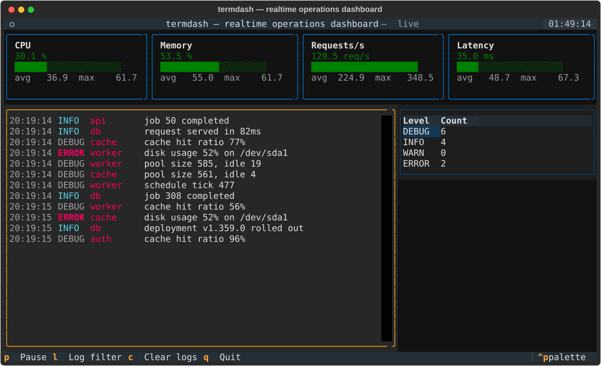

# termdash

[](.github/workflows/ci.yml)
[](LICENSE)

Realtime operations dashboard **in your terminal**, powered by
[Textual](https://textual.textualize.io/) — live metric gauges, a streaming
log feed with level filters, and a level-count table.



## Features

- **Live System Telemetry:** Real-time host CPU, Memory, Disk, and Network monitoring powered by `psutil`
- **Dynamic Unicode Sparklines:** Rolling history visualization (` ▂▃▄▅▆▇█`) on every gauge
- **Simulation Fallback:** Built-in `SimulatedSource` with `--simulated` flag for demos or headless testing
- **Streaming Log Feed:** Weighted level generation, bounded buffer, Rich markup rendering
- **Keyboard-Driven:** `p` pause · `l` cycle log filter · `c` clear · `q` quit

## Run

```bash
cd termdash
python -m venv .venv && source .venv/Scripts/activate
pip install -e .

termdash                     # Live system metrics (CPU, RAM, Network, Connections)
termdash --simulated         # Demo simulation mode
termdash --interval 1.0      # Custom update interval in seconds
```

> On Windows shells, if box-drawing characters look broken, run with `PYTHONUTF8=1`.

## Tests

```bash
pip install -e ".[dev]"
pytest
```
